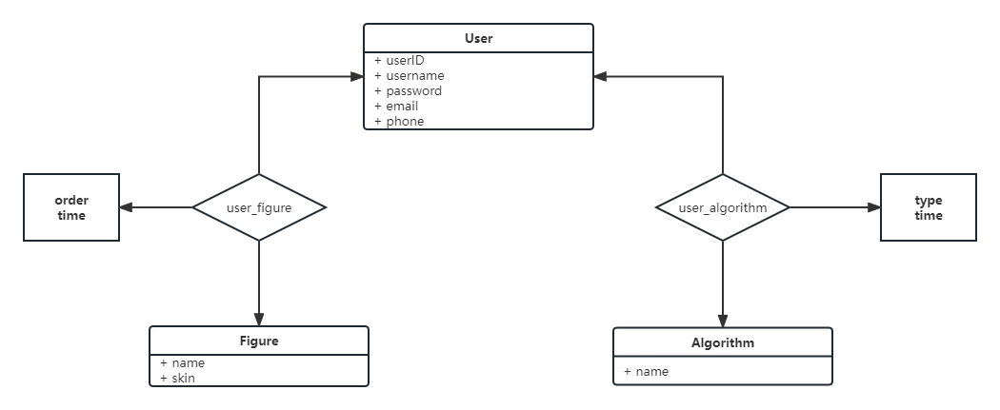

# 高级Web后端文档

20302010043 苏佳迪

## 一、Restful接口

### 0.1 统一的失败请求

响应码：400，在angular前端可以通过如下代码处理：

```typescript
this.http.post(url, body).subscribe(
  	(response : any) => {
		// 请求成功的回调
  	}, 
	(response : any) => {
        // 请求失败的回调，即后端返回400响应码，response.error可以得到后端返回的错误描述字符串
  	}
)
```

### 0.2 用户权限处理

后端采用token机制处理用户权限，前端在发送需要用到用户身份的请求时，只需要在请求头中添加`token = ...`即可，如果没有token不要加（而不是加一个`token = null`），其余不需要任何有关的用户信息，包括`userID`等。

另外，如果前端的一次请求中，请求头携带了`token`字段，那么后端会在响应头中同样设置`token = ...`用来更新token延长其时限，前端可以从`response.header`中拿到并保存。

### 1、登录

URL：/user/login

请求方法：Post

权限：/

请求体：

```json
{
    "email": "",
    "password": "",
}
```

响应体：

```json
{
    "token": ""
}
```

### 2、注册

URL：/user/register

请求方法：Post

权限：/

请求体：

```json
{
    "username": "",
    "password": "",
    "email": "",
    "phone": ""
}
```

（目前看前端并没有处理phone，所以这里的phone不用填也没事，后端没问题）

响应体：

```json
{
    "message": ""
}
```

（这个message其实没什么用，可以忽略，只要返回码是200不是`BadRequest`就是正确）

### 3、个人信息

URL：/user/profile

请求方法：Get

权限：login

请求体为空（请求头带token）

响应体：

```json
{
    "userID": 0,
    "username": "",
    "email": "",
    "phone": "",
    "figure": "",
    "skin": "",
    "algorithm": "",
    "learn": "",
    "practice": ""
}
```

其中`figure`为用户使用次数最多的角色，`skin`为用户使用次数最多的皮肤；`algorithm`为学习+练习总数最多的算法，`learn`为学习次数最多的算法，`practice`为练习次数最多的算法。

### 4、修改密码

URL：/user/chpwd

请求方法：Post

权限：login

请求体：

```json
{
    "oldpassword": "",
    "newpassword": ""
}
```

响应体：

```json
{
    "message": ""
}
```

### 5、形象选择历史记录

URL：/user/figures

请求方法：Get

权限：login

请求体为空

响应体：

```json
{
    "figures": [
        {
            "userID": 8,
            "figure": "",
            "skin": "",
            "order": 1,
            "time": ""
        },
        {
            ...
        },
    ]
}
```

其中`figures`数组的每个item是一条记录，`figure`为此次选择的形象，`skin`为此次选择的皮肤，`order`为这条记录的次序，`time`为该记录的时间。

### 6、用户最喜欢的形象和皮肤

URL：/user/favoriteFigureAndSkin

请求方法：Get

权限：login

请求体为空

响应体：

```json
{
    "figure": "",
    "skin": ""
}
```

其中`figure`为形象，`skin`为皮肤。

### 7、添加一次形象选择记录

URL：/user/addFigure

请求方法：Post

权限：login

请求体：

```json
{
    "figure": "",
    "skin": ""
}
```

响应体：

```json
{
    "message": ""
}
```

和register一样，如果响应没有报400就可以，正确响应的message可以不用管。

### 8、算法相关历史记录

URL：/user/algorithms

请求方法：Get

权限：login

请求体为空

响应体：

```json
{
    "userAlgorithmList": [
        {
            "userID": 8,
            "algorithm": "",
            "type": "",
            "time": ""
        },
        {
            ...
        }
    ]
}
```

其中`userAlgorithmList`数组的每个item是一条记录，`algorithm`为此次的算法，如`MergeSort`、`QuickSort`；`type`为此次选择的类型，包括`LEARN`和`PRACTICE`两种；`time`为该记录的时间。

### 9、算法相关历史统计信息

URL：/user/algorithmInfo

请求方法：Get

权限：login

请求体为空

响应体：

```json
{
    "infos": [
        {
            "userID": 8,
            "algorithm": "HeapSort",
            "learn": 1,
            "practice": 1
        },
        {
            "userID": 8,
            "algorithm": "MergeSort",
            "learn": 1,
            "practice": 1
        },
        {
            "userID": 8,
            "algorithm": "QuickSort",
            "learn": 2,
            "practice": 1
        }
    ]
}
```

其中`infos`数组的每一个item是一种算法的统计信息，`learn`为学习次数，`practice`为练习次数。

### 10、用户最喜欢的算法

URL：/user/favoriteAlgorithm

请求方法：Get

请求权限：login

请求体为空

响应体：

```json
{
    "total": "",
    "learn": "",
    "practice": ""
}
```

其中total为学习+练习总数最多的算法，learn为学习次数最多的算法，practice为练习次数最多的算法。

### 11、添加一条算法历史记录

URL：/user/addAlgorithm

请求方法：Post

请求权限：login

请求体：

```json
{
    "algorithm": "",
    "type": ""
}
```

algorithm为已有的算法，type为此条记录的类型：LEARN或PRACTICE

响应体：

```json
{
    "message": ""
}
```

和register一样，如果响应没有报400就可以，正确响应的message可以不用管。

## 二、数据库结构

数据库E-R图如下：



- User实体记录已注册的user信息，以`userID`为key；
- Figure为静态的数据表（用户不可修改），数据一旦设置不会再修改，记录所有已有的任务形象与皮肤；
- Algorithm同样为静态的数据表（用户不可修改），记录网页中已有的算法场景；
- user_figure联系集为user的一次figure选择记录（以该形象进入3D场景），该联系集携带属性`order`与`time`分别为用户选择形象的次数与时间；
- user_algorithm联系集为user的一次algorithm学习记录（进入相关算法场景），该联系集携带属性`type`与`time`分别为此次算法学习记录的类型（包括LEARN与PRACTICE）与时间；

其中两个联系集均有外键约束，即user_figure不能添加不存在的figure记录，user_algorithm不能添加不存在的algorithm记录。

## 三、实体类设计

项目中的实体类（entity）主要有两个用途：

1. 映射到数据库表结构；
2. 封装api响应结构体；

对应到数据表的操作，设计如下：

##### User

映射到User表：

```java
public class User {
    private Integer userID;				// 用户ID
    private String username;			// 用户名
    private String password;			// 密码
    private String email;				// 邮箱
    private String phone;				// 电话
}
```

##### UserFigure

映射到user_figure表：

```java
public class UserFigure {
    private Integer userID;				// 用户名
    private String figure;				// 所选形象
    private String skin;				// 所选皮肤
    private Integer order;				// 形象选择次数
    private Date time;					// 时间
}
```

##### UserAlgorithm

映射到user_algoritm表：

```java
public class UserAlgorithm {
    private Integer userID;				// 用户ID
    private String algorithm;			// 学习的算法
    private UserAlgorithmType type;		// 学习的类型，枚举：LEARN或PRACTICE
    private Date time;					// 学习的时间
}
```

封装为api响应体的结构如下：

##### UserInfo

用户的相关信息，包括username等基本数据，也包括figure与algorithm的历史统计数据：

```java
public class UserInfo {
    private Integer userID;				// 用户ID
    private String username;			// 用户名
    private String email;				// 邮件
    private String phone;				// 电话
    private String figure;				// 最喜欢使用的figure
    private String skin;				// 最喜欢使用的skin
    private String algorithm;			// 最常学习 + 练习的算法
    private String learn;				// 最常学习的算法
    private String practice;			// 最常练习的算法
}
```

##### UserAlgorithmInfo

针对某个算法，用户的学习历史统计数据：

```java
public class UserAlgorithmInfo {
    private Integer userID;				// 用户ID
    private String algorithm;			// 算法
    private Integer learn;				// 学习次数
    private Integer practice;			// 练习次数
}
```

## 四、权限管理

后端项目使用token + 注解的形式管理接口的权限。

##### 校验

通过使用`@TokenState()`注解修饰api接口，来表征该接口的权限要求，并注册统一的权限拦截器`AuthInterceptor`用来解析请求头中携带的的`token`字段信息，与权限要求的信息进行比对判断是否放行。

与之相关的类：

- 管理Token的生成、解析的工具类：TokenUtil
- 通过token描述用户信息的枚举类：TokenState
- 修饰api接口校验token的注解类：TokenCheck
- 权限拦截器：AuthInterceptor

上述类协调工作，完成一种表现形式类似AOP的权限校验机制，示例如下：

```java
@GetMapping(value = "/profile", produces = "application/json")
@ResponseBody
@TokenCheck(TokenState.USER_LOGIN)			// 注册校验为USER_LOGIN
public ResponseEntity<Object> profile(@RequestHeader String token) throws IOException {
    // ...
}
```

##### 更新

由于token具有时效性，为了避免用户一直活跃却出现token过期的问题，后端会在每次请求时检查请求头是否有token字段，如果有token字段会首先更新其时效性，并将新的token作为响应头的token字段返回，前端拿到后更新为新的时效token，从而避免上述问题。这部分代码实现如下：

```java
@Override
public boolean preHandle(HttpServletRequest request, HttpServletResponse response, Object handler) throws Exception {
	// ...
            token = TokenUtil.create(TokenUtil.get(token, TokenUtil.USERNAME));
            response.setHeader("token", token);					// 重新设置token到response.headers
    // ...
    return passed;
}
```

## 五、代码结构

##### 1、项目目录结构

```bash
$ tree
.
├── AdvancedWebBackendApplication.java					# 启动类
├── auth												# 权限管理相关类
│   ├── AuthInterceptor.java							# 权限拦截器
│   ├── TokenCheck.java									# token校验注解
│   └── TokenState.java									# token状态枚举
├── config												# 应用配置相关类
│   └── InterceptorConfig.java							# 注册权限拦截器
├── controller											# api控制器
│   ├── HelloController.java					
│   └── UserController.java								# user接口控制器
├── entity												# 实体类
│   ├── User.java										# 映射User表
│   ├── UserAlgorithm.java								# 映射UserAlgorithm表
│   ├── UserAlgorithmInfo.java							# 封装algorithm统计信息结构体
│   ├── UserAlgorithmType.java							# UserAlgorithm类型枚举
│   ├── UserFigure.java									# 映射UserFigure表
│   └── UserInfo.java									# 封装user信息结构体
├── mapper												# 数据库接口
│   ├── UserAlgorithmMapper.java						# 操作UserAlgorithm表
│   ├── UserFigureMapper.java							# 操作UserFigure表
│   └── UserMapper.java									# 操作User表
├── request												# 请求体封装
│   ├── UserAddAlgorithmRequest.java
│   ├── UserAddFigureRequest.java
│   ├── UserChpwdRequest.java
│   ├── UserLoginRequest.java
│   └── UserRegisterRequest.java
├── response											# 响应体封装
│   ├── ErrorResponse.java
│   ├── UserAddAlgorithmResponse.java
│   ├── UserAddFigureResponse.java
│   ├── UserAlgorithmInfoResponse.java
│   ├── UserAlgorithmsResponse.java
│   ├── UserChpwdResponse.java
│   ├── UserFavoriteAlgorithmResponse.java
│   ├── UserFavoriteFigureAndSkinResponse.java
│   ├── UserFiguresResponse.java
│   ├── UserListResponse.java
│   ├── UserLoginResponse.java
│   ├── UserProfileResponse.java
│   └── UserRegisterResponse.java
└── utils												# 工具类函数
    ├── SqlSessionUtil.java								# 数据库拦截session
    └── TokenUtil.java									# token

8 directories, 36 files
```

##### 2、架构与扩展性

后端编写过程中保持了良好的框架架构与代码的复用扩展性。例如：

1. 设置统一的权限管理拦截器，以类似AOP的形式管理权限，接口实现时只需要关注本身的业务逻辑即可，不需要关注权限的校验，解耦；
2. 封装接口的请求体与响应体，分别封装在包`request`与`response`中；同时设置api函数的返回值为`ResponseEntity<Object>`保证了接口返回数据的扩展性；
3. 设置统一的错误请求响应`ErrorResponse`，将错误响应与正确响应区分开，如`UserProfileResponse`的内容不需要考虑请求错误的情况，一方面解耦另一方面可以复用；
4. 鲁棒性：`TokenUtil`对外暴露函数`get(token, key)`从而解析得到token中包含的key信息；但由于key为预设的字符串（如`type`与`username`），为了避免函数调用传入预设之外的参数，TokenUtil对外暴露几个int的常量，用来映射到预设的字符串，若传入的int未知则返回null；

## 六、部署

使用Docker进行部署，以镜像的形式发布。编写Dockerfile将项目和依赖（java，mysql）一起打包到镜像中：

```dockerfile
FROM ubuntu:20.04

ARG DEBIAN_FRONTEND=noninteractive
RUN apt update && \
    apt-get -qq install -y openjdk-11-jre-headless && \
    apt-get -qq install -y mysql-server mysql-client

COPY adv_web.jar /app/adv_web.jar
COPY adv_web.sql /app/adv_web.sql

RUN service mysql start && \
    mysql -u root -e "CREATE DATABASE adv_web;" && \
    mysql -u root adv_web < /app/adv_web.sql && \
    mysql -u root -e "ALTER USER 'root'@'localhost' IDENTIFIED WITH mysql_native_password BY '12345';"

EXPOSE 8080

CMD service mysql start && java -jar /app/adv_web.jar		# 容器启动指令，运行jar包
```

启动doker时通过端口映射将宿主机的8080端口映射到容器内部的8080端口。